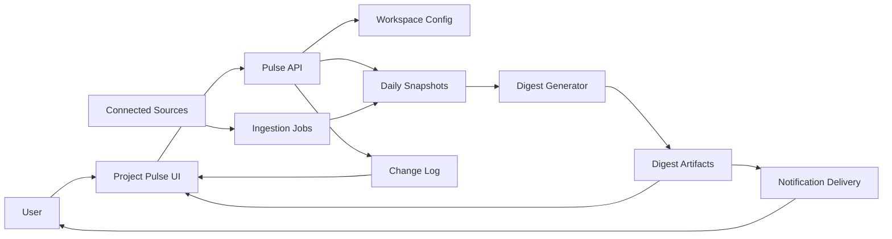

# Project Pulse — Delivery Digest & Risk Radar (Fictional) — Product Requirements Document
> *Author*: PRD Author (demo)
>
> *Date*: 2026-03-04
>
> *Status*: Draft (fictional example for reviewer demo)
>
> **Disclaimer**: This PRD is intentionally *made up* for documentation/review demonstrations. Names, numbers, and dependencies are illustrative only.

## 1. Overview
### 1.1 Problem statement
Product and engineering teams spend significant time producing status updates across multiple artifacts (work items, incident systems, meeting notes, emails/chats). The information is:
- **Fragmented** across tools (work tracking, calendar, docs, chat).
- **Stale** quickly (status decks lag reality).
- **Hard to trust** (no citations; unclear what changed since last update).
- **Non-actionable** (lists of activities rather than risks, blockers, and next actions).

As a result:
- PMs and leads lose hours/week on manual reporting.
- Executives lack timely, comparable signals across teams.
- Blockers and delivery risks surface late.

### 1.2 Proposed solution
**Project Pulse** is a lightweight product surface that produces:
1. A **daily delivery digest** (what changed, what is blocked, what is overdue, what needs decisions).
2. A **risk radar** dashboard (aging work, iteration end proximity, dependency risks).
3. A **traceable evidence model** (every summary statement links back to a source artifact).

Project Pulse integrates with common sources (work tracking + calendar + docs/chat) to generate an actionable, role-based view while respecting permissions and data minimization.

### 1.3 Target scenario (example)
A PM opens Project Pulse before standup:
- Sees that 3 items moved to “Blocked” since yesterday.
- Sees iteration ends in 8 days; WIP aging > 10 days spiked.
- Sees two meeting notes with decisions requested; one is already overdue.
- Clicks any signal to jump to the underlying work item or note.

## 2. Goals
### 2.1 Primary goal
Provide **actionable, trustworthy delivery visibility** with **minimal manual effort**.

### 2.2 Secondary goals
- Reduce time spent creating status updates.
- Detect delivery risks earlier (aging WIP, blocked chains, approaching milestones).
- Improve cross-functional alignment via consistent, cited digests.
- Enable rollup reporting (team → org) without bespoke slide decks.

### 2.3 Success metrics
**Adoption & engagement**
- ≥ 60% weekly active usage among invited PMs/engineering leads within 8 weeks of GA.
- ≥ 30% of recipients interact with the daily digest (open + click-through) at least 3x/week.

**Efficiency**
- Reduce manual status time by **≥ 2 hours/week** per PM/lead (self-reported survey + time study).

**Delivery outcomes (leading indicators)**
- 20% reduction in **average age of “In Progress” items** after 12 weeks.
- 15% reduction in **time-to-unblock** for blocked items (median).

**Trust & quality**
- ≥ 90% of digest statements include a **source citation**.
- < 2% user-reported “incorrect summary” rate per week.

## 3. Target Users
### 3.1 Primary users
- **Product managers**: need up-to-date delivery signals, decisions, and next actions.
- **Engineering leads**: need WIP health, blockers, and dependency visibility.

### 3.2 Secondary users
- **Program/project managers**: need cross-team rollups and timeline risks.
- **Executives**: need high-level trends and exceptions, not raw backlogs.
- **Individual contributors**: need personal next actions and clarity on blockers.

## 4. User Stories
1. **As a PM**, I want a daily digest of what changed since yesterday so that I can run standup and stakeholder updates without manually collecting updates.
2. **As an engineering lead**, I want to see which work items are blocked and *why* so that I can remove blockers quickly.
3. **As a program manager**, I want a rollup view by team/initiative so that I can identify at-risk areas across the portfolio.
4. **As an executive**, I want a weekly summary of key risks and trendlines so that I can intervene early.
5. **As a contributor**, I want my personal next actions extracted from meetings/tasks so that I don’t drop commitments.

## 5. Functional Requirements
> Requirements are written to be testable. “Should” statements are avoided.

### 5.1 Data sources & ingestion
1. The system must support connecting at least one **work tracking** source (e.g., Azure DevOps, Jira) via OAuth/app integration.
2. The system must support connecting at least one **calendar** source (e.g., Microsoft 365, Google Calendar).
3. The system must support connecting at least one **document/notes** source (e.g., SharePoint/OneDrive, Confluence) for meeting notes.
4. The system must support connecting at least one **chat** source (e.g., Teams, Slack) to detect commitments and decision requests.
5. The system must ingest data incrementally and store a **daily snapshot** per workspace/team.
6. The system must preserve a **change log** between snapshots (new items, state changes, ownership changes, due date changes).

### 5.2 Digest generation
7. The system must generate a **Daily Delivery Digest** for a workspace/team that includes:
   - New work items created in the last 24h.
   - Items with state changes in the last 24h.
   - Newly blocked items and top suspected blocker causes.
   - Overdue items and items nearing due date/iteration end.
   - Extracted action items assigned to the user (if identified in sources).
8. The digest must include **citations** per bullet (e.g., link to work item, meeting note, message thread, or doc section).
9. The digest must label content that is **inferred** vs **directly sourced**.
10. The system must allow users to choose delivery channels: in-app, email, and (optionally) Teams/Slack message.

### 5.3 Risk radar dashboard
11. The system must provide a dashboard with:
   - WIP aging distribution (e.g., 0–3d, 4–7d, 8–14d, 15d+).
   - Count of blocked items, and aging blocked items.
   - Iteration/milestone end countdown and scope burn-up (if available from source).
   - Dependency hotspots (e.g., items blocked by another team’s items).
12. The dashboard must support filtering by team, iteration, initiative/tag, and owner.
13. The dashboard must display “last refreshed” timestamp and data coverage (which sources were included).

### 5.4 Personalization & configuration
14. The system must support defining a **workspace/team configuration**:
   - Connected sources
   - Default iteration/milestone mapping
   - Notification schedule
   - Allowed audiences (who can see the workspace)
15. The system must support **role-based views** (PM vs lead vs exec) that change default KPIs and digest emphasis.
16. The system must support user-level settings for:
   - Quiet hours
   - Digest frequency (daily/3x weekly/weekly)
   - Followed initiatives/teams

### 5.5 Evidence & auditability
17. The system must store a structured representation of each digest:
   - Generated timestamp
   - Input snapshot IDs
   - Output sections and bullets
   - Citation targets
18. The system must provide an audit view that explains:
   - Why a given bullet appeared (rule or model reason)
   - Which artifacts contributed
   - Any missing-data warnings

### 5.6 Reliability requirements
19. The system must be idempotent for a given snapshot and configuration (re-running generation yields the same output, except for timestamps).
20. The system must degrade gracefully when a source is unavailable (show partial results + explicit “missing source” banner).
21. The system must complete daily digest generation for a workspace within **5 minutes** of scheduled time for P95.

## 6. Non-Goals (Out of Scope)
- Automatically changing work item states (e.g., moving items to Done) is out of scope.
- Replacing existing work tracking tools is out of scope.
- “Employee performance scoring” and sentiment scoring are out of scope.
- Automatic incident mitigation or on-call paging is out of scope.
- Real-time “second-by-second” dashboards are out of scope; daily/near-daily is sufficient for v1.

## 7. Technical Considerations
### 7.1 Architecture overview (conceptual)

### 7.2 Integration points
- Work tracking: items, states, iteration fields, links, dependencies.
- Calendar: meetings, attendees, meeting artifacts (notes links).
- Docs: meeting notes or decision logs (title + headings + last modified).
- Chat: messages containing assignments/requests (minimized extraction; store summaries, not bodies).

### 7.3 Dependency assumptions (fictional)
- An identity provider exists for SSO.
- A storage layer exists for snapshots and digest artifacts.
- A notification service exists for email and chat posting.

### 7.4 Data model considerations
- **Snapshots**: immutable daily snapshots keyed by workspace + date.
- **Change log**: derived diff between snapshots.
- **Digest artifact**: rendered markdown + structured JSON (for UI rendering and auditability).

### 7.5 Failure modes & mitigations (examples)
- Source API throttling → queue + backoff + partial snapshot.
- Permission mismatch → show “insufficient access” per source; never leak content.
- Summarization hallucination risk → enforce citation requirement; label inferred content; allow user feedback on bullets.

## 8. Design Considerations
### 8.1 UX principles
- **Action first**: highlight blockers, overdue, and decisions requested before “wins.”
- **Traceability**: every claim has a link.
- **Configurable but not fragile**: sensible defaults; minimal setup.

### 8.2 Primary surfaces
- **Home**: today’s digest + top 3 risks.
- **Risk Radar**: charts + tables for WIP age, blocked, upcoming deadlines.
- **Workspace Settings**: source connections, schedules, RBAC.
- **Audit**: explain a digest bullet with citations and rules.

### 8.3 Accessibility & internationalization
- The UI must meet WCAG 2.1 AA for color contrast and keyboard navigation.
- The system must support localized date/time formatting and time zones per user.

## 9. Security, Privacy, and RBAC
### 9.1 Data minimization
- The system must store **summaries and citations**, not full chat bodies or full email contents.
- The system must avoid persisting sensitive categories (e.g., HR, compensation) unless explicitly enabled by an admin policy.

### 9.2 Permission model (example)
| Role | Capabilities |
|---|---|
| Workspace Admin | Connect sources, manage settings, manage access, view all digests |
| Workspace Member | View digests + dashboard for permitted workspaces |
| Executive Viewer | View rollups only (no item-level details unless permitted) |
| Auditor | View audit trail + configuration history |

### 9.3 Compliance/audit expectations
- The system must log access to workspace digests and audit views.
- The system must support configurable retention (e.g., keep digests 90 days by default).

## 10. Success Criteria (Release Gates)
### 10.1 MVP (Private Preview) exit criteria
- Ingest from one work tracking source and generate daily digest for ≥ 5 pilot teams.
- ≥ 90% of digest bullets include citations.
- P95 digest generation time ≤ 5 minutes.
- No high-severity security issues found in threat model review.

### 10.2 GA criteria
- Supports at least two source categories (work tracking + calendar required).
- RBAC implemented and verified for cross-team data separation.
- User feedback loop: “thumbs up/down” per bullet + report incorrect summary.
- Operational SLOs defined and monitored (availability, latency, ingestion freshness).

## 11. Open Questions
1. Which work tracking source is the v1 priority (ADO vs Jira) for the target pilots?
2. What is the minimum viable rollup model for executives without leaking sensitive details?
3. Should the system support “initiative definitions” as first-class objects, or rely on tags/queries?
4. What is the acceptable level of inference for “suspected blocker cause” (rules only vs ML assistance)?
5. What are the retention requirements for digests and snapshots for different customers?
6. What feedback workflow should exist when users mark a bullet as incorrect?

---
*End of fictional PRD.*
